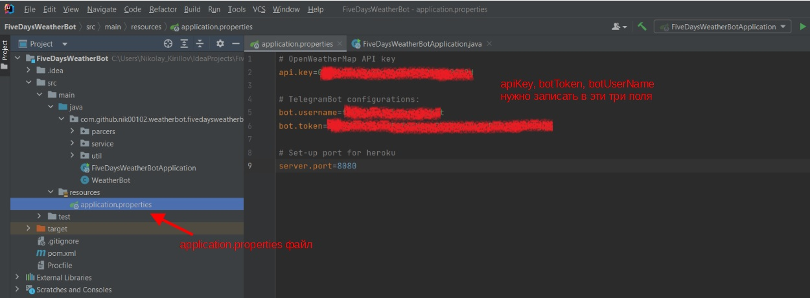
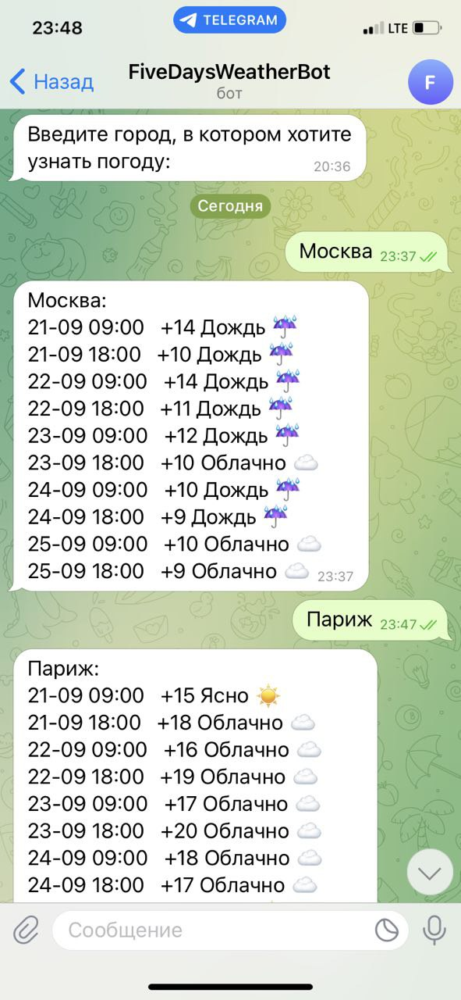

# FiveDaysWeatherBot

## Описание проекта:
Бот предоставляет возможность узнать прогноз погоды на пять дней в любом городе, используя приложение Telegram.

## Настройка и установка:
1. Запустите IntelliJ IDEA и создайте новый файл, используя GIT (File -> New -> Project from Version Control...).
2. Ссылка для скачивания https://github.com/Nik00102/FiveDaysWeatherBot.git .
3. Зарегистрируйтесь на сайте погоды https://openweathermap.org/, после регистрации будет доступен ключ API (*apiKey*).
4. Получите токен (*botToken*) и создайте нового бота (*botUserName*) через @BotFather в Telegram приложении коммандой "/newbot".
5. Запишите все полученные *apiKey*, *botToken*, *botUserName* в файл application.properties (расположен в папке */src/main/resources/*)

6. Скомпилируйте файл FiveDaysWeatherBotApplication.java. ___Бот будет доступен, пока запущен проект на вашей локальной машине.___
7. **Для того чтобы бот был доступен независимо от локальной машины, зарегистрируйтесь на сайте Heroku.com и создайте приложение на сайте.
Heroku - это облачная платформа, и ее можно использовать для того, чтобы запускать приложение не только на локальной машине, но и удаленно.**
8. Конфигурационный файл Procfile (без расширения, важно!) уже есть в директории проекта.
    Содержимое Procfile: **worker: java $JAVA_OPTS -jar target/FiveDaysWeatherBot-0.0.1-SNAPSHOT.jar**
 9. В папке с проектом в командной строке или bash необходимо выполнить команду: 
 **heroku login**
 10. Инициализируйте репозиторий:
**git init** 
11. Создайте новый контейнер heroku:
**heroku git:remote -a @имя вашего приложения heroku@**
12. Загрузите проект 
**git push heroku master**
13. Запустите бота 
**heroku ps:scale web=1**
14. Остановить бота можно командой
**heroku ps:scale web=0**
15. Получить лог можно командой
**heroku logs --tail**

## Окно информационного бота прогноза погоды

